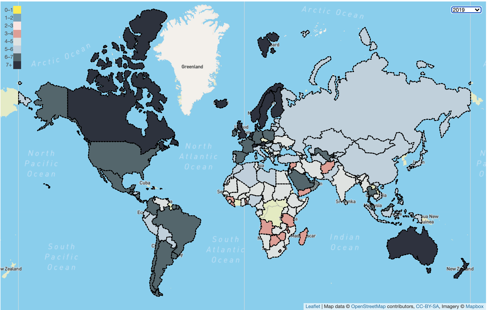
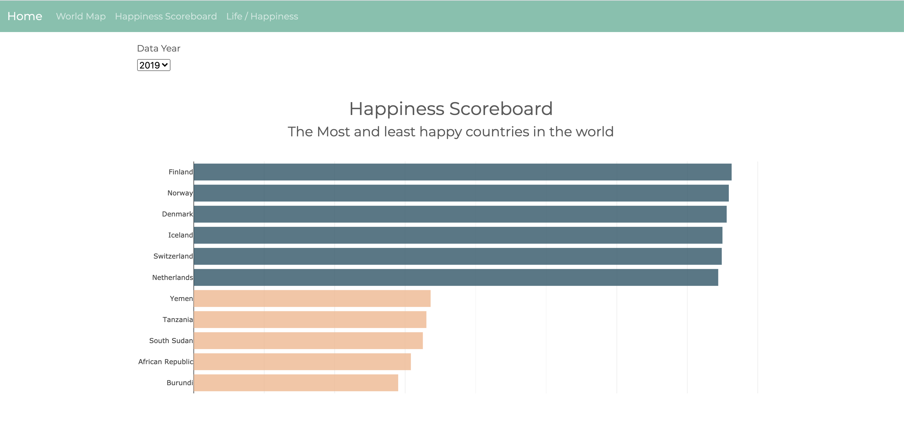
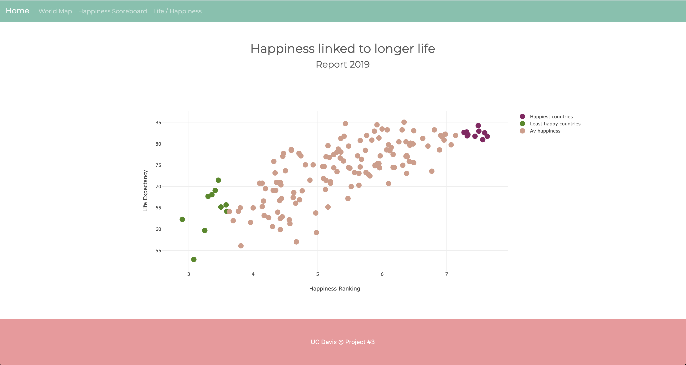

# Happiness-Project

## Review the project outline
The World Happiness Report is a landmark survey of the state of global happiness that ranks 156 countries by how happy their citizens perceive themselves to be.
What countries or regions rank the highest in overall happiness and each of the six factors contributing to happiness? How did country ranks or scores change between the 2015 and 2019 reports? Did any country experience a significant increase or decrease in happiness?

## Source.
[Kaggle](https://www.kaggle.com/unsdsn/world-happiness)

## ETL
In this section we do all about the Extract from Kaggle our data, Transform it to every single file meet our requirements to make a single merge in Pandas, to finally be able and Load all the data to MongoDB.
Once we have our database created  we proceed to develop Flask app to access to our data and make the requests to retrieve the data in our JavaScript files to deploy the World Map, Bar Chart and Scatter Plot using an open source JavaScript library as Leaflet and Plotly for JS.

## The Most and Least Happy Countries in the World.

## Relationship between the Happiness and Life Expectancy.

